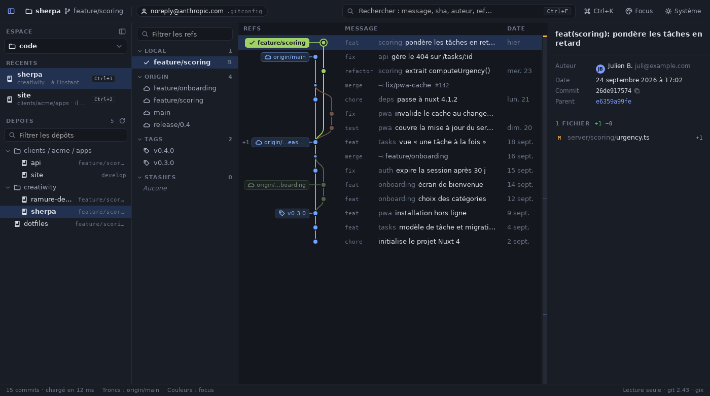
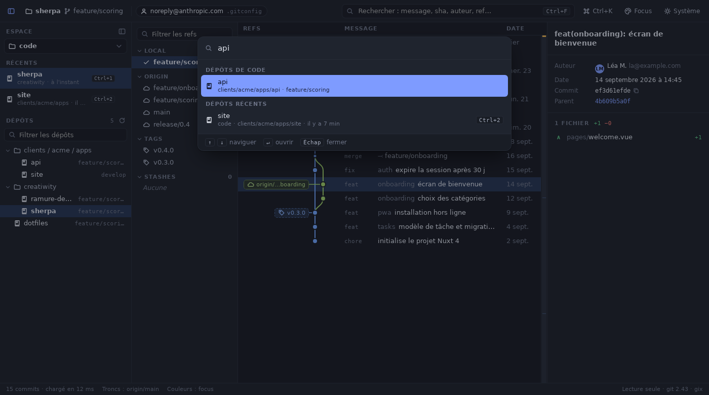

# Ramure

[](https://github.com/Creatiwity/ramure/actions/workflows/ci.yml)

> v0.2 (viewer) · spec v0.5 · open source (MIT OR Apache-2.0) · né dans l'incubator Creatiwity

## Résumé

**Viewer git** de bureau autonome (**Tauri 2 + Rust + Vue 3**) pour remplacer GitKraken, dont
l'équipe n'utilise qu'une petite partie : la visualisation du **commit graph**, la **recherche
instantanée**, le lancement de **rebase** et les commandes git courantes par **drag & drop** ou
**menu contextuel**. Priorité à la lisibilité du graph (refs · graph · messages alignés).

Ramure lit le dépôt (`gix`) et **ne le modifie jamais** : chaque geste produira une **commande git
native** expliquée, avec aperçu et commande d'annulation (y compris `git rebase --onto` pour les
branches empilées). Niveau 0 : la commande est copiée. Niveau 1 : elle est exécutée dans le
terminal choisi (au minimum le terminal par défaut du système, puis tmux, iTerm2, WezTerm,
kitty…), toujours dans le shell de l'utilisateur avec sa config (oh-my-zsh, alias…), ⌥ pour
copier à la place. Aucune intégration de service externe, aucune requête réseau, identités gérées
par la config git (`includeIf`).




## Ce que fait la v0.2

Phase 0 (prototype de performance) et phase 1 (viewer) de la feuille de route :

- **Espaces de travail** (nouveau en v0.2) : panneau latéral repliable (⌘/Ctrl+⇧E). On choisit
  un ou plusieurs dossiers racines (par exemple `~/code`) ; pour le dossier actif, Ramure
  affiche les **derniers dépôts ouverts** avec leur date et un raccourci ⌘/Ctrl+1…9, et
  l'**arbre des dépôts** trouvés dedans, où les dossiers qui ne contiennent qu'un sous-dossier
  sont fusionnés en une ligne (`clients / acme / apps`, comme VS Code). Tout est sauvegardé
  automatiquement dans le dossier de configuration de Ramure ; chaque dossier racine peut être
  retiré (les dépôts ne sont pas touchés).
- **Palette de commandes** (⌘/Ctrl+K, nouveau en v0.2) : dépôts récents de tous les contextes,
  dépôts du contexte actif, changement de contexte, branches et tags du dépôt ouvert, actions.

- **Graph** : trois zones refs · graph · messages alignés, pastilles reliées à leur nœud,
  largeur de graph constante, lanes « straight branches » avec `main` puis `develop` épinglés à
  gauche, couleur « focus » (branche courante + troncs, le reste désaturé ; arc-en-ciel en
  option), type Conventional Commits en sous-colonne, merges raccourcis (`⤙ fix/pwa-cache #142`),
  date affichée seulement au changement de jour, auteur répété atténué, ligne WIP, stashes,
  minimap. Lignes virtualisées, lanes dessinées sur canvas pour la seule fenêtre visible.
- **Recherche** au fil de la frappe (⌘/Ctrl+F) : floue sur message, auteur et refs, préfixe de
  sha, opérateurs `author:`, `msg:`, `ref:`, `sha:` ; mode « surligner », ↵ / ⇧↵ entre les
  résultats, compteur et durée, marques dans la minimap.
- **Détails** du commit (message, auteur, dates, parents cliquables, signature) et **diff** par
  fichier ; changements non commités en lecture seule.
- **Barre latérale** : branches locales, distantes par remote, tags, stashes, avec filtre.
- **Identité git effective** et fichier de config d'où elle vient.
- **Rafraîchissement automatique** : un commit, un checkout ou un fetch fait dans le terminal
  met le graph à jour tout seul, sans perdre la sélection.
- Thèmes clair et sombre (suit le système), clavier : ↑/↓ ou j/k, PageUp/PageDown, Home/End,
  `h` pour aller à HEAD.

Quand la vue du graph est étroite (panneau ouvert sur un petit écran), la colonne auteur passe
dans l'infobulle de la date et les pastilles se resserrent.

Pas encore : commandes générées, menus contextuels, drag & drop, rebase interactif, intégration
terminal (phases 2 et 3, voir la spec §7).



## Démarrage

Prérequis : Rust ≥ 1.94, Node ≥ 22, git ≥ 2.38, et les
[dépendances système de Tauri](https://v2.tauri.app/start/prerequisites/) (sous Linux :
`libwebkit2gtk-4.1-dev`, `libgtk-3-dev`, `librsvg2-dev`).

```bash
npm install
npx tauri dev -- -- /chemin/absolu/vers/un/depot   # application native, rechargement à chaud
npx tauri build                                    # binaire et installeurs dans target/release/
```

En développement, l'application est lancée depuis `src-tauri/` : passez un chemin absolu. Sans
argument, Ramure ouvre le dossier courant s'il est dans un dépôt git, sinon propose d'en ouvrir un
(⌘/Ctrl+O, ou glisser un dossier sur la fenêtre). Le binaire installé s'utilise comme
`ramure <dépôt>`.

Mode navigateur (développement de l'interface sans l'application native, sur un vrai dépôt
exporté) :

```bash
fixtures/sample-repo.sh fixtures/sample-repo   # dépôt d'exemple des maquettes
npm run sample                                 # exporte public/sample.json
npm run dev                                    # http://localhost:1420
```

## Installeurs et signature

Le workflow `release.yml` produit les installeurs macOS (universel, signé et notarisé), Linux et
Windows à chaque tag `vX.Y.Z`, dans une release GitHub en brouillon. Secrets attendus, procédure
Apple et publication : [`docs/PACKAGING.md`](docs/PACKAGING.md).

## Tests et qualité

```bash
cargo test -p ramure-core        # lanes, recherche, parsing, dépôts git réels créés à la volée
npm test                         # utilitaires du front (vitest)
npm run typecheck                # vue-tsc
cargo clippy --workspace --all-targets && cargo fmt --all --check
```

Un test vérifie que l'ouverture d'un dépôt ne modifie ni ses refs ni son index.

Performances : voir [`PERF.md`](./PERF.md) (dépôt synthétique de 100 000 commits généré par
`fixtures/gen-repo.py`).

## Contenu du dépôt

- `spec-ramure.md` : cahier des charges (objectifs, fonctionnalités F-xx en MoSCoW, exigences
  de performance, architecture, feuille de route, risques, critères d'acceptation) ; fait foi.
- `ux-graph.md` : analyse de lisibilité du commit graph (principes UX sourcés, décisions D1 à
  D8, protocole de test).
- `design-board.html` : planche design. À ouvrir dans un navigateur.
- `PERF.md` : mesures de performance de la v0.1.
- `crates/ramure-core/` : cœur Rust sans dépendance à Tauri. `repo.rs` (chargement via gix),
  `graph.rs` (tri date-order, lanes, arêtes), `search.rs` (nucleo), `gitcli.rs` (git en lecture
  seule : statut, stashes, détails, diffs, identité), `view.rs` (objets envoyés au front),
  `workspace.rs` (scan des dépôts sous un dossier racine, store des espaces et des récents).
  Exemples : `bench` (mesures), `dump` (export pour le mode navigateur).
- `src-tauri/` : application Tauri (commandes IPC, watcher du dépôt).
- `src/` : front Vue 3 + TypeScript (`GraphView.vue` pour le graph, `api.ts` pour l'accès au
  cœur et le backend de démonstration).
- `fixtures/` : génération du dépôt d'exemple et du dépôt de 100 000 commits.
- `docs/` : captures d'écran.
- `.github/workflows/` : CI (`ci.yml`) et release (`release.yml`).
- `scripts/check-version.mjs` : vérifie que les trois fichiers de version concordent (et avec le tag).

## Licence

Double licence, au choix : [MIT](LICENSE-MIT) ou [Apache 2.0](LICENSE-APACHE).
